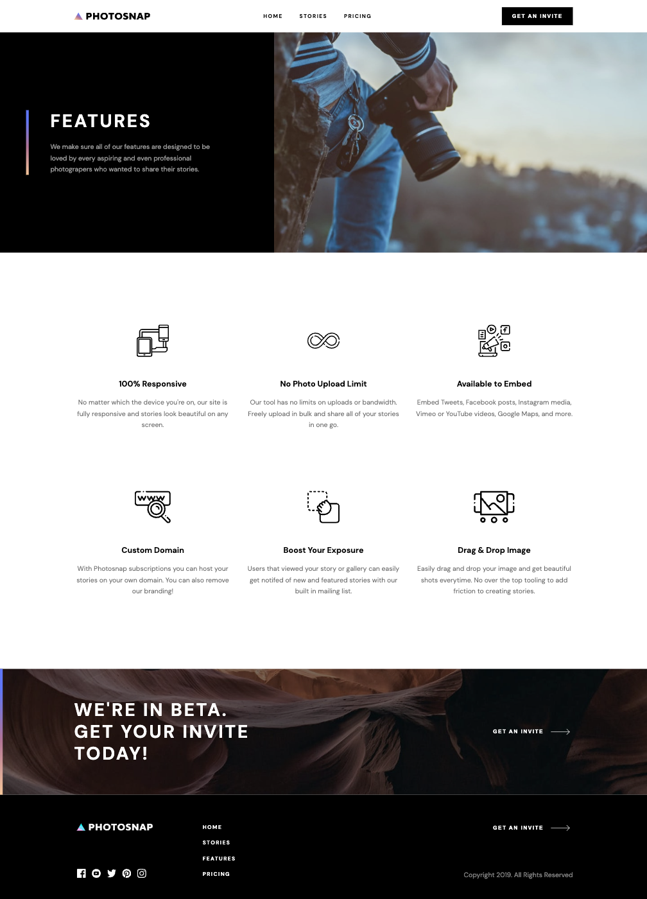

# project - Photosnap Website

## Overview

In this challange we made responsive Photosnap  website with HTML/CSS and Javascript.
Our goal was to make it Pixsel perfect responsive and work without mistakes.

### Screenshot

- Home - 
- Stories - 
- Features - 
- Pricing - 
- Pricing active - 

### Links

- Solution URL: https://github.com/Moses1058/Team_016
- Live Site URL: https://moses1058.github.io/Team_016/

### Built with

- Semantic HTML5 markup
- CSS custom properties
- Flexbox
- CSS Grid
- Mobile-first workflow
- Javascript

### What I learned
- With this project we learned how to work as team, also we learned how to make git pull request, fetch and merge.With this project we experienced working and understanding other developers code.

**Note: Delete this note and the content within this section and replace with your own learnings.**

### Continued development

In the future projects we want to get more experienced in HTML/CSS and JS also to continue developing .

**Note: Delete this note and the content within this section and replace with your own plans for continued development.**

### Useful resources

- [Mozila](https://developer.mozilla.org/en-US/docs/Web/API/EventTarget/addEventListener) - this helped us with js. eventListeners
- [W3Schools]https://www.w3schools.com/howto/howto_css_switch.asp - this website helped us to make toggle button

## Authors

- Mariam Iniashvili - GitHub - https://github.com/mariaminiashvili
- Levan Papidze - GitHub - https://github.com/Mea22?tab=repositories
- Vazha Labadze - GitHub https://github.com/Vazha93
